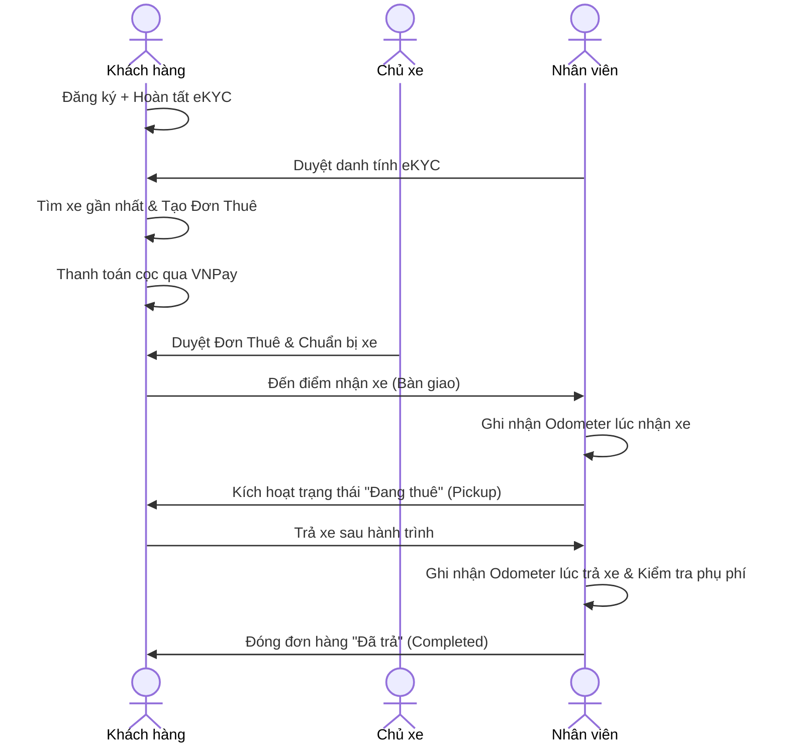

# 🛵 Motov - Nền Tảng Cho Thuê Xe Máy Trực Tuyến

Motov là một ứng dụng web và di động hiện đại hỗ trợ quy trình cho thuê xe máy toàn diện, giúp kết nối Khách thuê (Customer) và Đối tác chủ xe (Owner) dưới sự quản lý và vận hành của Nhân viên (Staff) và Quản trị viên (Admin).

*   **Website (Vercel):** [motov-client.vercel.app](https://motov-client.vercel.app)
*   **Server API (Render):** [motov.onrender.com](https://motov.onrender.com)

---

## 🛠️ Stack Công Nghệ

*   **Frontend Web:** React.js (Vite, TypeScript, Tailwind CSS, Lucide React, Framer Motion)
*   **Mobile App:** React Native (Expo, Redux Toolkit, React Navigation)
*   **Backend Server:** Node.js (Express.js, TypeScript, TSX, Mongoose)
*   **Cơ sở dữ liệu:** MongoDB (với chỉ mục `2dsphere` truy vấn tọa độ xe gần nhất)

---

## 🚀 Hướng Dẫn Cài Đặt Nhanh (Local Setup)

### Điều kiện tiên quyết
*   Node.js 18+ và npm
*   Môi trường cơ sở dữ liệu MongoDB đang chạy cục bộ hoặc trên Cloud

### 1. Tải dự án và cài đặt Dependencies
```bash
git clone <repository-url>
cd Motov
npm install
```

### 2. Cấu hình biến môi trường
Tạo file `.env` tại **thư mục gốc (root)** của dự án với nội dung mẫu sau:
```env
# Cấu hình Server Backend
PORT=5000
MONGODB_URI=mongodb://localhost:27017/Motov
JWT_SECRET=motov_super_secret_key_998877
JWT_EXPIRES_IN=2h
REFRESH_TOKEN_SECRET=motov_refresh_super_secret_9988

# Cấu hình Firebase Server (cho Phone OTP - tùy chọn ở dev)
FIREBASE_KEY_PATH=firebase-key.json
FIREBASE_PROJECT_ID=motov-747f0

# Cấu hình VNPay Sandbox
VNP_TMNCODE=5G8G4T6U
VNP_HASHSECRET=U3EPGXQEH12AXJ6NBKB7IZLTFWMBOG4T
VNP_URL=https://sandbox.vnpayment.vn/paymentv2/vpcpay.html
VNP_RETURNURL=http://localhost:3000/vnpay-return

# Cấu hình SMTP Email (Gmail)
SMTP_HOST=smtp.gmail.com
SMTP_PORT=587
SMTP_SECURE=false
SMTP_USER=your_email@gmail.com
SMTP_PASS=your_app_password

# Cấu hình Twilio SMS (tùy chọn gửi SMS)
TWILIO_ACCOUNT_SID=your_twilio_sid
TWILIO_AUTH_TOKEN=your_twilio_token
TWILIO_SMS_FROM=your_twilio_number

# Cấu hình Client (Vite React)
VITE_API_URL=http://localhost:5000/api
VITE_GOOGLE_CLIENT_ID=your_google_client_id.apps.googleusercontent.com
```

### 3. Chạy dự án dưới máy local

*   **Chạy Web & Backend song song (Development):**
    ```bash
    npm run dev
    ```
    *   Website chạy tại: `http://localhost:3000`
    *   Server API chạy tại: `http://localhost:5000`

*   **Chạy ứng dụng Mobile (Expo):**
    ```bash
    npm run mobile
    ```
    *   Expo Web chạy tại: `http://localhost:8081` hoặc mở ứng dụng Expo Go trên điện thoại quét mã QR.

---

## 🔐 Danh Sách Tài Khoản Kiểm Thử (Seeded Accounts)

Hệ thống đã tự động cấu hình dữ liệu mẫu kiểm thử trong Database khi chạy lần đầu:

| Vai trò (Role) | Email | Mật khẩu (Password) | Ghi chú |
| :--- | :--- | :--- | :--- |
| **Admin** (Quản trị) | `admin@motov.com` | `admin123` | Quản lý người dùng, cài đặt hệ thống, khuyến mãi |
| **Staff** (Nhân viên) | `nhanvien@motov.com` | `admin123` | Phê duyệt eKYC, xác nhận giao/nhận xe, quản lý kho |
| **Owner** (Chủ xe) | `owner@motov.com` | `admin123` | Quản lý danh sách xe máy, duyệt đơn đặt xe |
| **Customer** (Khách thuê) | `khachhang@motov.com` | `admin123` | Tìm xe, eKYC, đặt xe, thanh toán VNPay |

---

## 🎯 Các Tính Năng Nổi Bật

### 1. Định danh khách hàng bằng AI (eKYC & OCR)
*   Khách hàng tải lên ảnh 2 mặt CCCD và ảnh selfie.
*   Hệ thống tự động phân tích trích xuất dữ liệu chữ từ ảnh (OCR) và so khớp tỷ lệ giống nhau giữa khuôn mặt chân dung và ảnh trên thẻ căn cước.

### 2. Tích hợp thanh toán VNPay Sandbox
*   Sau khi tạo đơn thuê xe thành công, hệ thống sinh đường dẫn thanh toán VNPay Gateway.
*   Hỗ trợ xử lý trạng thái giao dịch tự động thông qua cơ chế IPN (Instant Payment Notification) từ máy chủ VNPay phản hồi về backend.

### 3. Nhắc nhở SMS Twilio & Lịch Trình Tự Động (Cron Job)
*   Sử dụng Scheduler chạy ngầm để quét các đơn thuê xe sắp đến thời hạn nhận hoặc trả xe.
*   Tự động kích hoạt SMS Twilio gửi tin nhắn nhắc nhở trực tiếp đến số điện thoại di động của khách hàng.

### 4. Tìm kiếm Xe Theo Vị Trí Bản Đồ (GPS Geolocation)
*   Định vị tọa độ thực tế của xe trên bản đồ Leaflet.
*   Khách thuê xe có thể lọc các dòng xe máy gần nhất xung quanh tọa độ hiện tại của mình trong bán kính cấu hình tùy ý.

### 5. Chat và Trao đổi thời gian thực (Real-time Chat)
*   Hệ thống Chat nội bộ được xây dựng trên công nghệ Socket.io.
*   Hỗ trợ khách hàng nhắn tin trực tiếp thảo luận với đối tác chủ xe về tình trạng bàn giao hoặc thỏa thuận nhận xe.

---

## 🔄 Luồng Nghiệp Vụ Thuê Xe (Booking Workflow)



---

## 🗄️ Cấu Trúc Cơ Sở Dữ Liệu (MongoDB Schema)

*   `users`: Lưu trữ thông tin tài khoản, cấu hình vai trò, trạng thái định danh eKYC và các dòng xe yêu thích.
*   `vehicles`: Quản lý xe máy, biển số xe, định vị vị trí địa lý GeoJSON (`coordinates`), thông tin số km bảo dưỡng.
*   `bookings`: Tài liệu đơn đặt xe, mã số đơn thuê, thông tin giá thuê, lịch hẹn nhận/trả xe, hóa đơn thanh toán và các khoản phụ phí.
*   `discounts`: Quản lý voucher khuyến mãi, giá trị giảm giá, thời hạn sử dụng và số lượt giới hạn tối đa.
*   `feedbacks`: Lưu trữ đánh giá sao và bình luận của khách hàng về chuyến đi.
*   `conversations` & `messages`: Lưu trữ dữ liệu hộp thoại chat real-time.
*   `inventories`: Quản lý danh mục linh kiện phụ tùng trong kho của nhân viên.
*   `bookingreminders`: Nhật ký lưu trữ lịch trình và trạng thái các tin nhắn nhắc nhở SMS tự động.

---

## 🧪 Quy Trình Chạy Kiểm Thử (Tests & Build)

*   **Chạy toàn bộ Test Suite Backend:**
    ```bash
    npm run test --prefix server
    ```
*   **Kiểm tra cú pháp Type Check (Mobile):**
    ```bash
    npx tsc --noEmit --project mobile/tsconfig.json
    ```
*   **Kiểm tra biên dịch đóng gói (Web Frontend):**
    ```bash
    npm run build --prefix client
    ```

---

## 📄 Bản Quyền & Giấy Phép
Dự án được phân phối dưới giấy phép **MIT License**. Mọi quyền được bảo lưu.